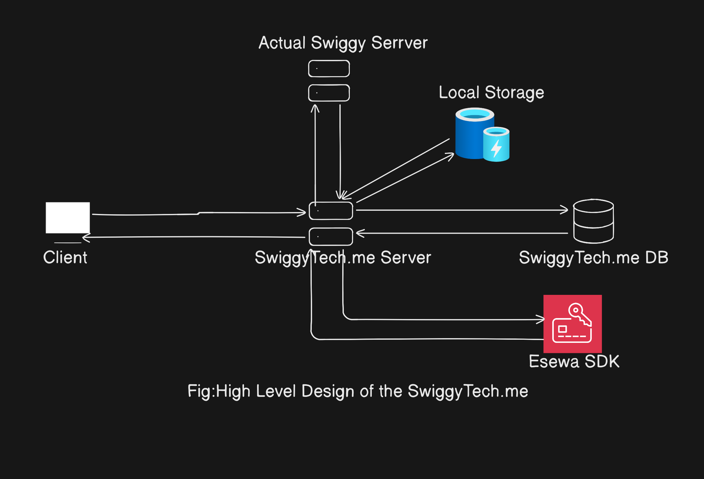
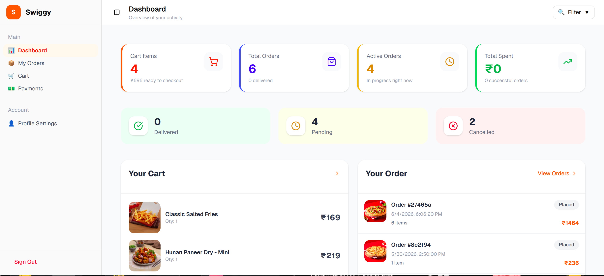
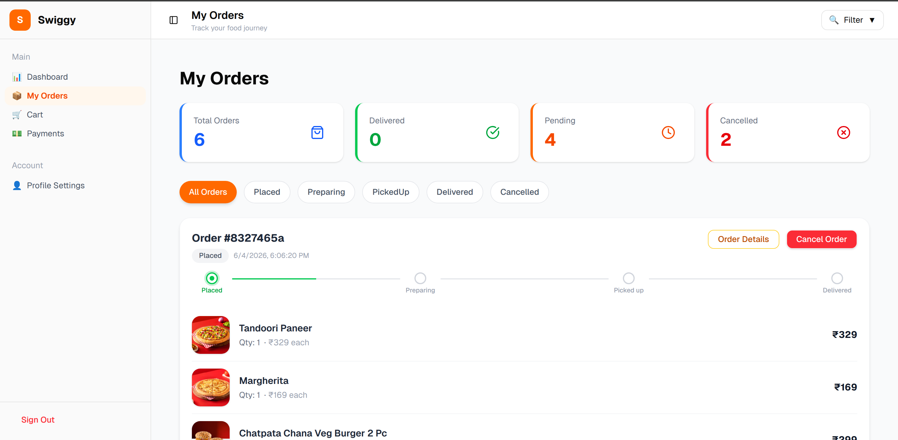
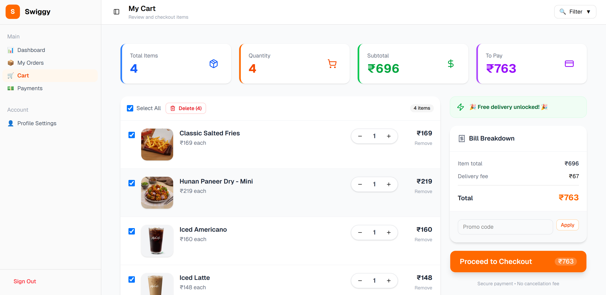
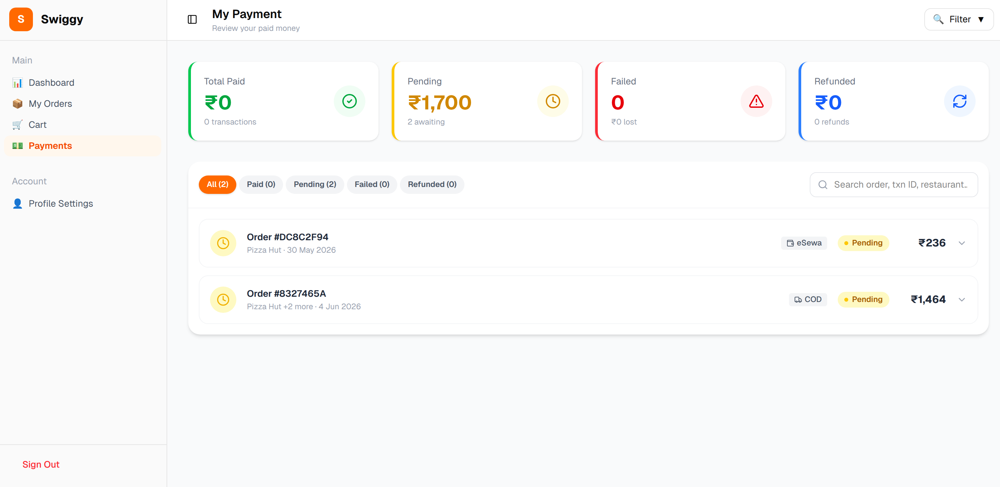
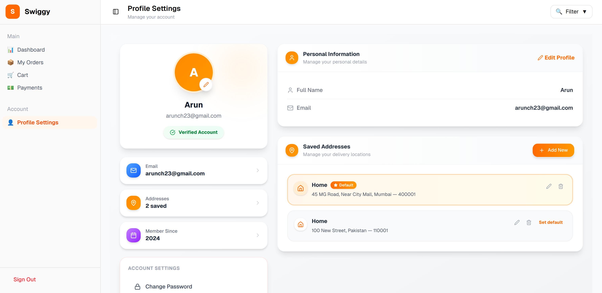

# 🍽️ Swiggy Project 

### A full-stack food delivery web application inspired by Swiggy, built using the MERN stack.It replicates real-world food ordering systems including authentication, restaurant browsing, cart management, order processing, user dashboard, and eSewa payment gateway integration 


## 📘 API Documentation (Swagger)

### You can view the full API documentation here:
-  http://localhost:5000/api-docs

## 📑 Table of Contents

- [Features](#features)
- [Screenshots](#screenshots)
- [Demo Video](#demo-video)
- [Tech Stack](#tech-stack)
- [Project Structure](#project-structure)
- [Getting Started](#getting-started)
- [Running the Application](#running-the-application)
- [API Endpoints](#api-endpoints)
- [Author](#-author)


## Features
###  Core User Experience
- Modern landing page with food delivery, grocery, and dine-out sections
- Browse restaurants with filtering and dynamic search
-Detailed restaurant menu with food items, pricing, and descriptions
- Smooth and responsive UI built with Tailwind CSS
- Shimmer loading states for better UX

###  Authentication System
- User registration and login system
- JWT-based authentication
- Protected routes for authenticated users
- Secure logout functionality
###  User Dashboard
- Centralized dashboard for user account management
-View profile information
- Manage saved addresses
-Access order history and payment records
- Navigate cart and checkout flow


###  Cart & Order System
- Add and remove items from cart
- Update item quantities in real time
- Sync cart with backend
- Create orders from cart
- View order history and order details
- Cancel or reorder previous orders
###  Payment Integration (eSewa Simulation)
- eSewa payment gateway integration for checkout flow
- Payment initiation and transaction handling
- Payment verification via backend
- Success and failure callback handling pages
- Order linked with transaction ID for tracking
###  Address Management
- Add multiple delivery addresses
- Update and delete saved addresses
- Set default delivery address

## ScreenShots
 ###  High Level Design
 
 ### Dashbaord
 

 ### Order 

   
### Cart

    
 ###  Payment 


 ### Profile Page
 


## Demo Video

##  Tech Stack
### Frontend
- **React 19.1.0** - Modern React with latest features
- **Vite** - Fast build tool and development server
- **React Router** - Client-side routing
- **Tailwind CSS** - Utility-first CSS framework
- **ESLint** - Code linting and formatting

### Backend
- **Node.js** - JavaScript runtime
- **Express.js** - Web application framework
- **Axios** - HTTP client for API requests
- **MongoDb**--NoSQL Db for the Database
- **dotenv** - Environment variable management

## Project Structure
```Swiggy Project:-
─ Assets
│   ├── Cart.png
│   ├── Dashboard.png
│   ├── HighLevelDesign.png
│   ├── Order.png
│   ├── Payment.png
│   └── Profile.png
├── Backend
│   ├── index.js
│   ├── package.json
│   ├── package-lock.json
│   ├── README.md
│   └── src
│       ├── config
│       │   ├── db.js
│       │   ├── redis.js
│       │   └── swagger
│       │       ├── swagger.config.js
│       │       ├── swagger.options.js
│       │       └── swagger.schemas.js
│       ├── controllers
│       │   ├── cart-controller.js
│       │   ├── order-controller.js
│       │   ├── payment-controller.js
│       │   ├── restaurant-controller.js
│       │   └── user-controller.js
│       ├── docs
│       │   ├── cart.swagger.js
│       │   ├── order.swagger.js
│       │   ├── payment.swagger.js
│       │   ├── restaurant.swagger.js
│       │   └── user.swagger.js
│       ├── middleware
│       │   ├── adminMiddleware.js
│       │   └── userMiddleware.js
│       ├── models
│       │   ├── cart.js
│       │   ├── order.js
│       │   ├── payment.js
│       │   └── user.js
│       ├── routes
│       │   ├── cart-routes.js
│       │   ├── order-routes.js
│       │   ├── payment-routes.js
│       │   ├── restaurant-routes.js
│       │   └── user-routes.js
│       └── utils
│           ├── cartTransfromer.js
│           ├── constant.js
│           ├── getFormattedCart.js
│           ├── helper
│           │   └── esewaSignature.js
│           └── validate.js
├── Frontend
│   ├── components.json
│   ├── eslint.config.js
│   ├── index.html
│   ├── jsconfig.json
│   ├── package.json
│   ├── package-lock.json
│   ├── README.md
│   ├── src
│   │   ├── App.jsx
│   │   ├── components
│   │   │   ├── CartComponent.jsx
│   │   │   ├── City
│   │   │   │   ├── CityDelivery.jsx
│   │   │   │   ├── FoodDelivery.jsx
│   │   │   │   └── GroceryDelivery.jsx
│   │   │   ├── Dineout
│   │   │   │   ├── DineCard.jsx
│   │   │   │   └── DineOption.jsx
│   │   │   ├── Failure.jsx
│   │   │   ├── Food
│   │   │   │   ├── FoodCard.jsx
│   │   │   │   └── FoodOption.jsx
│   │   │   ├── Footer
│   │   │   │   ├── Footer.jsx
│   │   │   │   └── Scanner.jsx
│   │   │   ├── Header
│   │   │   │   ├── CommonHeader.jsx
│   │   │   │   └── Header.jsx
│   │   │   ├── ResturantFoodMenu
│   │   │   │   ├── MenuCard.jsx
│   │   │   │   ├── MenuDetails.jsx
│   │   │   │   └── ResturantFoodMenu.jsx
│   │   │   ├── Resturants
│   │   │   │   ├── BestCuisine.jsx
│   │   │   │   ├── BestPlacesToEat.jsx
│   │   │   │   ├── ExploreRestaurant.jsx
│   │   │   │   ├── FilterRestaurant.jsx
│   │   │   │   ├── RestaurantAllFood.jsx
│   │   │   │   ├── RestaurantDataFetch.jsx
│   │   │   │   ├── RestaurantTopFoodCard.jsx
│   │   │   │   ├── RestaurantTopFood.jsx
│   │   │   │   └── RestFoodData.jsx
│   │   │   ├── Shimmer
│   │   │   │   ├── ShimmerMenuPage.jsx
│   │   │   │   └── TopFoodShimmer.jsx
│   │   │   ├── ShopItems
│   │   │   │   ├── ShopCard.jsx
│   │   │   │   └── ShopOption.jsx
│   │   │   ├── Success.jsx
│   │   │   └── ui
│   │   │       ├── avatar.jsx
│   │   │       ├── badge.jsx
│   │   │       ├── breadcrumb.jsx
│   │   │       ├── button.jsx
│   │   │       ├── card.jsx
│   │   │       ├── collapsible.jsx
│   │   │       ├── dropdown-menu.jsx
│   │   │       ├── input.jsx
│   │   │       ├── scroll-area.jsx
│   │   │       ├── separator.jsx
│   │   │       ├── sheet.jsx
│   │   │       ├── sidebar.jsx
│   │   │       ├── skeleton.jsx
│   │   │       └── tooltip.jsx
│   │   ├── hooks
│   │   │   ├── useAuth.jsx
│   │   │   ├── useCartSelection.jsx
│   │   │   ├── useDebounce.jsx
│   │   │   └── use-mobile.js
│   │   ├── index.css
│   │   ├── layout
│   │   │   ├── AuthLayout.jsx
│   │   │   ├── DashboardLayout.jsx
│   │   │   └── MainLayout.jsx
│   │   ├── lib
│   │   │   ├── esewa.js
│   │   │   └── utils.js
│   │   ├── main.jsx
│   │   ├── pages
│   │   │   ├── Cart.jsx
│   │   │   ├── CheckoutPage.jsx
│   │   │   ├── Dashboard.jsx
│   │   │   ├── Home.jsx
│   │   │   ├── Login.jsx
│   │   │   ├── Order.jsx
│   │   │   ├── PaymentPage.jsx
│   │   │   ├── ProfileSettings.jsx
│   │   │   ├── Register.jsx
│   │   │   ├── ResturantMenu.jsx
│   │   │   ├── Resturants.jsx
│   │   │   └── SearchPage.jsx
│   │   ├── routes
│   │   │   ├── AuthRoutes.jsx
│   │   │   ├── OpenRoutes.jsx
│   │   │   └── ProtectedRoutes.jsx
│   │   ├── slices
│   │   │   ├── CartSlice.js
│   │   │   ├── FoodMenuSlice.js
│   │   │   ├── OrderSlice.js
│   │   │   ├── RedirectSlice.js
│   │   │   ├── ResturantSlice.js
│   │   │   └── UserSlice.js
│   │   ├── Store
│   │   │   └── Store.js
│   │   └── Utils
│   │       ├── axiosClient.js
│   │       ├── CacheManager.js
│   │       ├── Constants.js
│   │       ├── DineData.js
│   │       ├── foodDataFormatter.js
│   │       ├── FoodData.js
│   │       ├── FoodOnlineAddress.js
│   │       ├── GroceryOnlineAddress.js
│   │       ├── helper.jsx
│   │       └── ShopData.js
│   └── vite.config.js
└── README.md
```
##  Getting Started
### Prerequisites
- Node.js (v16 or higher)
- npm

### Installation

1. **Clone the repository**
   ```bash
   git clone https://github.com/Arun23-dev/Swiggy_Clone.git
   cd Swiggy-Project
   ```

2. **Install Frontend Dependencies**
   ```bash
   cd Frontend
   npm install
   ```

3. **Install Backend Dependencies**
   ```bash
   cd ../Backend
   npm install
   ```

4. **Environment Setup**
   
   Create a `.env` file in the Backend directory:
   ```env
   PORT=3000
   FRONTEND_URL=http://localhost:5173
   DB_CONNECT_KEY=YOUR_OWN
   REDIS_HOST=YOUR_OWN
   REDIS_PORT=YOUR_OWN

   JWT_KEY=YOUR_OWN

   # eSewa Configuration
   ESEWA_MERCHANT_ID=EPAYTEST
   ESEWA_SECRET_KEY="8gBm/:&EnhH.1/q"
   ESEWA_PAYMENT_URL=https://rc-epay.esewa.com.np/api/epay/main/v2/form
   ESEWA_PAYMENT_STATUS_CHECK_URL=https://rc.esewa.com.np/api/epay/transaction/status

   ```

### Running the Application

1. **Start the Backend Server**
   ```bash
   cd Backend
   npm run dev
   ```
   The backend will run on `http://localhost:3000`

2. **Start the Frontend Development Server**
   ```bash
   cd Frontend
   npm run dev
   ```
   The frontend will run on `http://localhost:5173`


##  API Endpoints

## Frontend API Routes
- `/` – Home page
- `/restaurants` – List all restaurants
- `/city/delhi/:restaurantId` – Restaurant menu page
- `/city/delhi/:restaurantId/search` – Search inside restaurant
- ` /checkout` – Checkout page

### Auth Routes 
- `/register` – User registration page
- `/login` – User login page
- `/logout` -User Logged out 

### Protected Routes (Only for logged-in users)
### Dashboard
- `/dashboard` – User dashboard
- `/dashboard/orders` – My orders
- `/dashboard/cart` – My cart
- `/dashboard/payment` – Payment page
- `/dashboard/profile` – Profile settings

### Payment Callback Routes (Public)
- `/checkout/payment/esewa/success` – Payment success page
- `/checkout/payment/esewa/failure` – Payment failure page


## Backend API Routes
### For Restaurants 
- `GET /api/restaurants/` - Fetch restaurant data
- `GET /api/restaurants/:restaurantId` - Fetch restaurant menu by ID

### For User
- `POST /api/user/register `– Register a new user
- `POST /api/user/login `– Login user
- `POST /api/user/logout` – Logout user (Protected)
- `GET /api/user/me `– check the user is authenticated or not 


### For Address (User Protected Routes)
- `POST /api/user/address` – Add new address
- `GET /api/user/address` – Get all saved addresses
- `PUT /api/user/address/:addressId` – Update address
- ` DELETE /api/user/address/:addressId` – Delete address
- `PATCH /api/user/address/:addressId/default` – Set default address


### For Cart
- `GET /api/cart/` – Get user cart (Protected)
- `PATCH /api/cart/item/:itemId` – Update item quantity in cart (Protected)
- `DELETE /api/cart/selectedItems `– Remove selected items from cart (Protected)
-  `DELETE /api/cart/clear` – Clear entire cart (Protected)
- `POST /api/cart/sync` – Sync cart data with backend (Protected)

### For Orders
- `POST /api/orders/` – Create a new order (Protected)
- `GET /api/orders/ `– Get all orders of logged-in user (Protected)
- `GET /api/orders/:orderId` – Get order details by ID (Protected)
- `PATCH /api/orders/:orderId/cancel` – Cancel an order (Protected)
- `PATCH /api/orders/:orderId/status` – Update order status (Admin/Protected)
- `POST /api/orders/:orderId/reorder` – Reorder a previous order (Protected)
- ` GET /api/orders/by-transaction/`:transactionId – Get order by transaction ID

### For Payment 
- `POST /api/payment/esewa/initiate` – Initiate eSewa payment
- `GET /api/payment/esewa/verify` – Verify eSewa payment
- `GET /api/payment/` – Get user payment history (Protected)

## 👨‍💻 Author

**Arun Chaudhary**  
Full-Stack Developer (MERN Stack)

---

### 🔗 Connect with me
- 🐙 GitHub: [@Arun23-dev](https://github.com/Arun23-dev)
- 💼 LinkedIn:https://www.linkedin.com/in/aruncodees/
- 🚀 Project Repo: [Swiggy Food Delivery Web](https://github.com/Arun23-dev/Swiggy-food-delivery-Web)